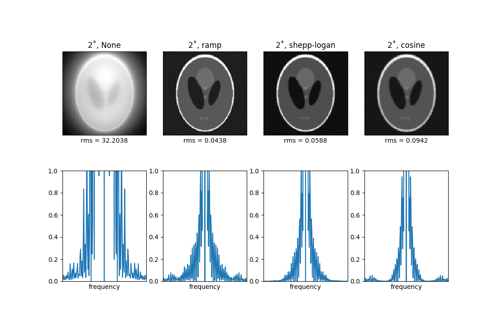

# Electron Tomography

## 3D reconstruction

#### The object

#### The comparison of oriinal and reconstructed objects

## The angle-interval depended error trend

## The filters used in skimage

## Compare reconstruction by different filters

